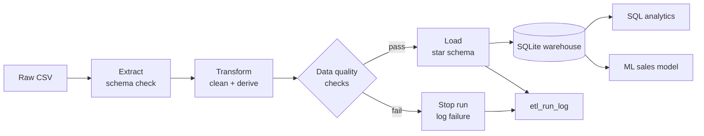
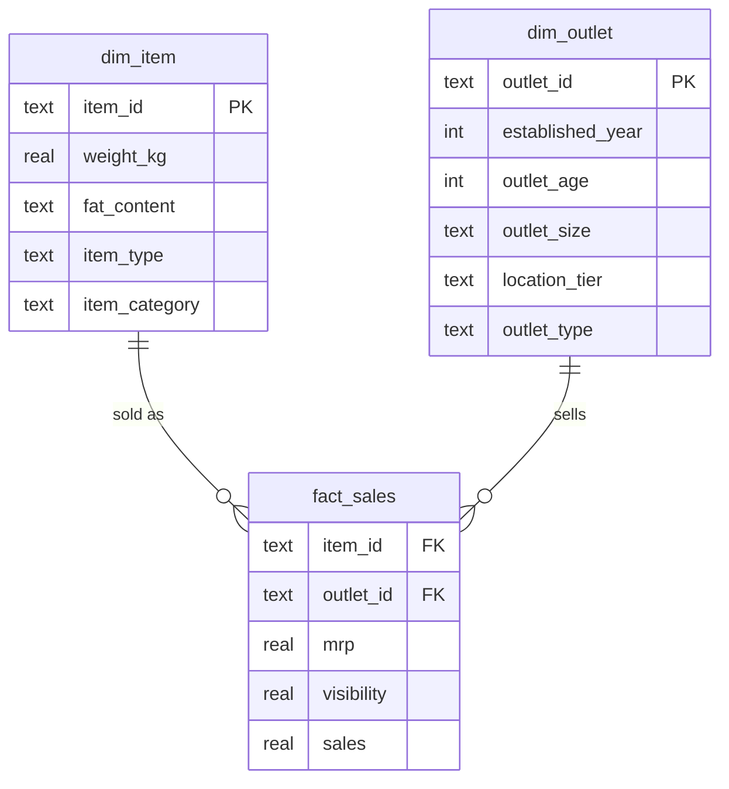

# BigMart Sales Data Pipeline


An end-to-end **ETL pipeline** that takes raw retail sales data, cleans it, checks its quality, loads it into a **star-schema data warehouse**, and serves it to **SQL analytics** and a **machine learning model**.

It is built the way a production pipeline should be: tested, logged, auditable, safe to re-run, and checked automatically on every push with GitHub Actions.

## Why this project

The BigMart dataset (sales of 1,559 products across 10 stores in 2013) is messy in realistic ways: the same value is spelled several ways, weights and store sizes are missing, and some products show impossible 0% shelf visibility. Most tutorials clean this inside a notebook. This project treats it as a data engineering problem: repeatable steps, explicit data quality rules, and a warehouse that analysts and models can trust.

## Architecture



More detail: [docs/architecture.md](docs/architecture.md)

## What it does

| Stage | What happens |
|---|---|
| **Extract** | Reads the CSV and rejects it if required columns are missing. |
| **Transform** | Unifies fat-content spellings (`LF`, `low fat`, `reg`), marks non-consumables as `Non-Edible`, fills missing weights from the same item in other stores, replaces zero visibility, fills missing store sizes by store type, and derives item category and store age. |
| **Validate** | Runs 9 data quality checks (nulls, duplicate keys, value ranges, allowed values, outliers). Any failed error-level check stops the run before bad data reaches the warehouse. A JSON report is written for every run. |
| **Load** | Writes `dim_item`, `dim_outlet` and `fact_sales` in a single transaction. Loads are idempotent: re-running does not create duplicates. |
| **Audit** | Every run, successful or failed, is recorded in `etl_run_log` with row counts and any error. |
| **Analyse** | SQL queries using joins, CTEs and window functions (`sql/analytics/`). |
| **Model** | A random forest predicts item sales from warehouse data and is compared against a predict-the-average baseline. |

## Data model



## Quick start

```bash
git clone https://github.com/ThembelihleMncube/bigmart-sales-data-pipeline.git
cd bigmart-sales-data-pipeline
python -m venv .venv
source .venv/bin/activate          # Windows: .venv\Scripts\activate
pip install -r requirements.txt

pytest -v                          # run the tests
python -m src.pipeline.run         # run the ETL pipeline
python scripts/run_query.py sql/analytics/01_sales_by_outlet_type.sql
python -m src.model.train          # train and evaluate the model
```

### Data

The repo includes a small **synthetic** sample (`data/sample/bigmart_sample.csv`, made by `scripts/generate_sample_data.py`). It has the same columns and the same data problems as the real file, so everything runs straight after cloning, but its numbers are made up.

To use the real data, download the BigMart Sales training file from Kaggle (search "BigMart Sales Data") and save it as `data/raw/bigmart_sales.csv`. The pipeline uses that file automatically when it exists. Raw data is not committed to the repo (see `.gitignore`).

## Results

> Results below are from the synthetic sample. Replace them after running on the real dataset.

| Model | RMSE | MAE | R² |
|---|---|---|---|
| Baseline (predict average) | 1156.56 | 947.24 | 0.00 |
| Random forest | 464.93 | 333.10 | 0.84 |

## Project structure

```
├── .github/workflows/ci.yml   # lint, test and run the pipeline on every push
├── data/
│   ├── raw/                   # real data goes here (not committed)
│   └── sample/                # synthetic sample data
├── docs/architecture.md       # design decisions
├── scripts/
│   ├── generate_sample_data.py
│   └── run_query.py
├── sql/
│   ├── schema.sql             # star schema + run log
│   └── analytics/             # analysis queries
├── src/
│   ├── pipeline/              # extract, transform, quality, load, run
│   └── model/train.py
└── tests/                     # unit and end-to-end tests
```

## Skills demonstrated

SQL · Python · pandas · ETL · data quality · dimensional modelling · SQLite · pytest · Git · GitHub Actions CI · scikit-learn · logging and auditability

## Next steps

- Move the warehouse to PostgreSQL or Azure SQL Database.
- Schedule runs with Apache Airflow or Azure Data Factory.
- Rebuild the transform layer in dbt with its built-in tests.
- Add incremental loads for new daily sales files.

## Author

**Thembelihle Mncube** · [LinkedIn](https://linkedin.com/in/thembelihle-mncube-1a317a193)
